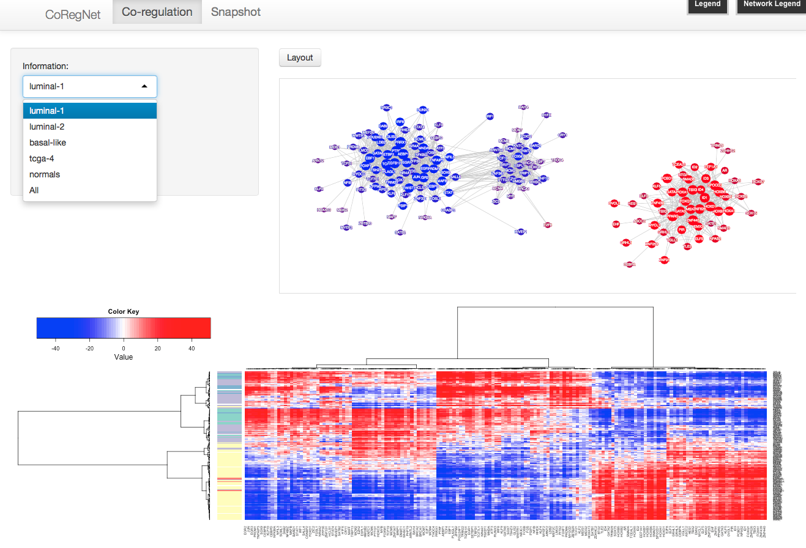
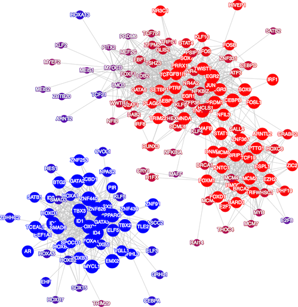
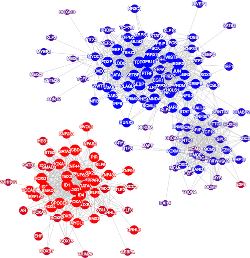
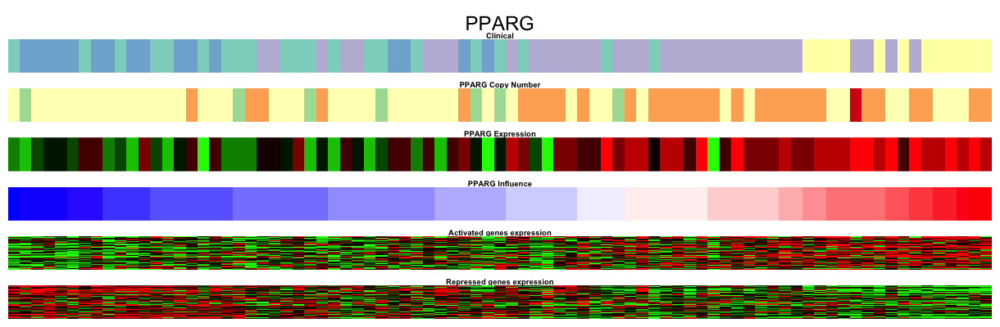

This Vignette accompagnies the _CoRegNet_ package. It can be used either
to get some additional information about the methods or to get examples
of the use of the functions. Feel free to ask any question to the
package maintainer (remy.c.nicolle at gmail dot com).


# Introduction

The _CoRegNet_ package aims at inferred a large scale transcription
co-regulatory network from transcriptomic data, integrate external data
on gene regulation to infer and analyse transcriptional programs. The
particularity of the network inference algorithm proposed in the package
is to learn co-regulation netwok in which the regulation is modeled by
transcription factors which act in a cooperative manner to
synergistically regulate target genes.

The package was used in a study of Bladder Cancer to identify the driver
transcriptional programs from a set of 183 samples. Throughout this
Vignette, a smaller version of the transcriptomic dataset is used to
illustrate the use of the package.

```{r, eval=FALSE}
        library(CoRegNet)
        data(CIT_BLCA_EXP,HumanTF)
        dim(CIT_BLCA_EXP)
        #showing 6 first TF in the gene expression dataset
        head(intersect(rownames(CIT_BLCA_EXP),HumanTF))
```

# Quick user guide

Here are the main functionalities of CoRegNet

1. Reconsruct a large-scale regulatory network from gene expression data
	```
		GRN = hLICORN(CIT_BLCA_EXP)
	```
	
2. Infer transcription factor activity
	```
		influence = regulatorInfluence(GRN,CIT_BLCA_EXP)
	```
	
3. Retrieve inferred co-coregulators
	```
		coregs= coregulators(GRN)
	```
	
4. Analyze the network of cooperative regulators using an interactive display
	```
		display(GRN,CIT_BLCA_EXP,influence)
	```


Each of these steps are more

# Construction of a large scale co-regulatory network from gene expression data


The inference algorithm implemented in the package is a hybrid version
of the LICORN algorithm which is both based on a discrete and continuous
version of the gene expression data. The reconstruction of the network
involves 4 steps. First, the gene expression data is discretized.
Second, all the potential sets of cooperative regulators are extracted
using the *apriori* algorithm of frequent itemset mining. Third, the
best combinations of co-activators and co-inhibitors are identified for
each genes. Finally, a continuous model of regulation using a linear
regression method with interaction terms is used to score the local gene
regulatory network for each gene.


The minimal input datasets is :
* a gene expression data.frame or
matrix with unique column and row names containing sample and gene names
respectively 
* a list of genes to be considered as Transcription factor
(TF). The package contains a default list of TF either in the form of
official gene symbol or EntrezGene IDs.

```{r, eval=FALSE}
    # An example of how to infer a co-regulation network
    grn =hLICORN(CIT_BLCA_EXP, TFlist=HumanTF)
    print(grn)
```


The transcriptomic dataset is by default discretized using the
_discretizeExpressionData_. The two main use of these function is either
with or without a set of reference samples from the difference to the
mean is used to set an expression value to -1, 0 or 1 using a predefined
threshold. See the help for more details. A user defined method can be
used to discretize the data using for instance a mixture of gaussian to
identify samples in which a given gene is over-expressed,
under-expressed or does not change.

```{r, eval=FALSE}
    #default discretization. Uses the standard deviation of the whole dataset to set a threshold.
    disc1=discretizeExpressionData(CIT_BLCA_EXP)
    table(disc1)
    boxplot(as.matrix(CIT_BLCA_EXP)~disc1)

    #Discretization with a hard threshold
    disc2=discretizeExpressionData(CIT_BLCA_EXP, threshold=1)
    table(disc2)
    boxplot(as.matrix(CIT_BLCA_EXP)~disc2)

    # more examples here
    help(discretizeExpressionData)
```


The overall inference process is highly parallelizable since it can be
indepedently launched on each target gene and therefore can be divided
in as many threads as there are genes to infer regulators on. By default
the *hLICORN* function uses the *mclapply* function of the *parallel*
package (default in R >= 3.0), which itself uses 2 cores by default.

```{r, eval=FALSE}
# running only on the 200 first gene in the matrix for fast analysis
    # Choosing to divide in 4 threads whenever possible
    options("mc.cores"=4)
    grn =hLICORN(head(CIT_BLCA_EXP,200), TFlist=HumanTF)
    print(grn)
    options("mc.cores"=2)
    grn =hLICORN(head(CIT_BLCA_EXP,200), TFlist=HumanTF)
    print(grn)
```


Although H-LICORN is an inference algorithm which is particularly
efficient in identifying co-regulators, that is cooperative
transcription factor, the package allows to input a regulatory network
inferred by other methods or even experimentally defined.


# Refining the inferred regulatory networks

The second step of the analysis uses external knowledge to enrich the
inferred regulatory network. Two types of external data can be use :
regulatory information such as Transcription Factor Binding Sites (TFBS)
or ChIP data to support TF to gene interaction and co-regulatory
information such as protein-protein interaction to support cooperative
TF. These datasets can be easily integrated in a *coregnet* object using
two functions : _addEvidences}_ and _addCooperativeEvidences_.


```{r, eval=FALSE}
    # ChIP data from the CHEA database
    data(CHEA_sub)

    #ChIP data from the ENCODE project
    data(ENCODE_sub)

    # Protein protein interactions between TF from the HIPPIE database
    data(HIPPIE_sub)

    # Protein protein interactions between TF from the STRING database
    data(STRING_sub)

    enrichedGRN = addEvidences(grn,CHEA_sub,ENCODE_sub)
    enrichedGRN = addCooperativeEvidences(enrichedGRN,HIPPIE_sub,STRING_sub)
```


The _coregnet_ object with added evidences contains a statistical
analysis of the enrichment of the inferred interactions in the validated
external evidences using a fisher exact test as exemplified below.

```{r, eval=FALSE}
    print(enrichedGRN)
```


The added evidences can also be used to refine the inferred network and
select local gene regulatory network based on the added external
knowledge. This is done based on the work of the modEncode consortium
which proposed a method to integrate orthogonal datasets (Transcriptome,
Epigenetic marks, binding sites, ..) to learn a global network.
Briefly, the method assigns one scores for each dataset to all possible
interactions to assign a final score using a weighted mean. This final
merged score is used to select the best regulatory interactions. Here,
instead of scoring and selecting single edges, the methods is extended
to work with local regulatory network (sets of co-activators and
co-inhibitors of a given gene). For each dataset, a score is assigned to
each local network by counting the number of validated interactions
found in the local network normalised by the total number of possible
interactions. The score given by the network inference method, an
adjusted R2 in the case of hLICORN, and each of the score given by the
external datasets are then merged. Two methods are proposed to do so.
The default is the unsupervised method, a simple unweighted mean, and
was shown by the modENCODE consortium to give the best results. The
supervised method uses a user defined reference dataset as a reference
set of interactions. A Generalized Linear Model is then used to predict
the presence of a reference interaction based on the score of the other
datasets including the network inference score.

```{r, eval=FALSE}
        # Default unsupervised refinement method
    refinedGRN = refine(enrichedGRN)
    print(refinedGRN)
    # Example of supervised refinement with the CHEA chip data
    refinedGRN = refine(enrichedGRN, integration="supervised",
            referenceEvidence="CHEA_sub")
    print(refinedGRN)
```

_N.B._ : It is possible to integrate regulatory evidences to *coregnet*
networks inferred using other methods than *hLICORN*. However,
integrating co-regulatory evidences and refining the network is only
relevant on networks encoding local regulatory network originally
containing cooperative regulators instead of simple TF to gene
interaction pairs.


# Identification of active transcriptional programs

The goal of the _CoRegNet_ package is to identify the sets of active
cooperative TF in a given sample or set of samples. A measure of
transcriptional activity was developed to estimate the level of activity
of given transcription regulator in a given sample. This measure, termed
the influence, is the comparison the expression of the activated and
repressed genes of a TF in a transcriptional network. It is based on a
measure of divergence (welch's t statistics) of these two sets of genes
in one sample. Basically, if the genes activated by a TF are highly
expressed while the repressed genes are under-expressed, the TF has a
high influence. Using a coregulatory network encoded in a _coregnet_    
object and a matrix of gene expression, wether it is the data use for
the inference or another one (cell lines transcriptomes for instance).
The output is a matrix with the same number of columns (samples) and as
many rows (TF) as TF with a sufficient number of targets (min 10
activated and 10 repressed) in the transcriptional network.

```{r, eval=FALSE}
    CITinf =regulatorInfluence(grn,CIT_BLCA_EXP)

```    


    This new dataset of transcriptional influence can be used as a condensed
view of the whole transcriptome dataset. Data mining and machine
learning can be applied to it to identify clusters, predict sample
classes or extracting relevant features. More interestingly, it can be
used to visualize the entire dataset with a much smaller number of
feature making heatmaps a sufficient tools to evualuate all samples. The
package proposes a visualization tool based on an interactive shiny
webpage. The objective of the embeded visualization tool is to navigate
the transcriptional programs through the network of cooperative
transcription factors and identify the specific transcriptional program
of a sample or a set of samples defined by a clinical subgroup.

Preliminary to the analysis of transcriptional program is the
identification of the network of co-regulators underlying these
programs. The definition of a pair of cooperative TF or co-regulator is
dependent on the method used to construct the network, that is, wether
it contains simple pairs of regulation (TF -> Gene, inferred using the
ARACNE algorithm for instance) or sets of cooperative TF regulating each
gene ({TF1,TF2,...} -> Gene, inferred using the LICORN algorithm). From
the pair regulatory network, all combination of TF sharing at least one
target gene is considered as a potential pair of co-regulator. From the
cooperative network, these are defined by all pairs of TF which were
inferred to be cooperative in the regulation of at least one target
gene. Then, the significance of these pairs is tested using fisher's
exact test to assess wether these pairs of TF share more target genes
than expected by chance (Benjamini-Hochberg multi test correction is
applied). The final co-regulation network is defined by an edge between
all pairs of significant TF (FDR 1%).


```{r, eval=FALSE}
    # Coregulators of a hLICORN  inferred network
    head(coregulators(grn))
    #  Coregulators of an ARACNE inferred network
    head(coregulators(CITCoRTN))

```
    

In order to exemplify the use of the proposed analysis tool, additional
data are available through the package : the classification of our
samples (based on the TCGA classification) and the copy number status of
the transcription factor in the CIT cohort.
  
 
```{r, eval=FALSE}
    data(CIT_BLCA_CNV)
    data(CIT_BLCA_Subgroup)
```


The minimum requirement to launch the visualization tool is a _coregnet}
network object and a transcriptomic dataset. The influence dataset can
also be added to accelerate the initialisation of the webpage but is
otherwise recomputed and is therefore optional.


```{r, eval=FALSE}
    display(grn,expressionData=CIT_BLCA_EXP,TFA=CITinf)
```


The top left part of the shiny application is used to change several
parameters of the application.


The first selection input is usable only if a sample classification is
available. When a particular subgroup is selected, the cytoscape network
on the right, the nodes representing TF will adapt their color based on
their mean activity level in the selected set of samples. If alteration
data is available, the piechart inside each node will by modified to
show the proportion of each copy number status in the selected set of
samples.

The second input specifies an integer used as a threshold to select
pairs of TF which share a minimum number of target genes (local
regulatory network for hLICORN inferred network). This parameter
controls the number of TFs and pairs of TFs displayed.

The third input can be used to search a TF in the network.

The layout button can be used to change the layout of the network. This
can be a long process for larg networks.

The second panel is the cytoscape app to visualize and manipulate the
network of coregulators.

The last panel is used to display specific plots. A heatmap of TF
influence is displayed by default. If only a subset of TF are selected
in the cytoscape panel, the heatmap will only display the influenceof
the selected TF. Selecting a single TF will display data specific to
that TF which is dependent on the data used as input. Each of the data
is represented as an array of color ordered by the activity of the
selected TF. The plotted data includes the expression of the TF, the
activity of the TF and the expression of the activated and the repressed
samples.

The visualization tool can also handle alteration data, sample
classification and evidences of regulation or co-regulation. Several
examples are shown below.

 
```{r, eval=FALSE}
    # Visualizing additional regulatory or co-regulatory evidences in the network
    display(enrichedGRN,expressionData=CIT_BLCA_EXP,TFA=CITinf)

    # Visualizing alterations of the TF
    display(grn,expressionData=CIT_BLCA_EXP,TFA=CITinf,alterationData=CIT_BLCA_CNV )

    # Visualizing sample classification using a named factor
    citclinical=CIT_BLCA_Subgroup$subgroup
    names(citclinical) =CIT_BLCA_Subgroup$samples
    display(grn,expressionData=CIT_BLCA_EXP,TFA=CITinf,clinicalData=citclinical)

    # Visualizing sample classification using a list
    citclinical=split(CIT_BLCA_Subgroup$samples,CIT_BLCA_Subgroup$subgroup)
    display(grn,expressionData=CIT_BLCA_EXP,TFA=CITinf,clinicalData=citclinical)

    display(grn,expressionData=CIT_BLCA_EXP,TFA=CITinf,alterationData=CIT_BLCA_CNV,
            clinicalData=citclinical)
```


_N.B._ : the Cytoscape network snapshot is experimental and usually is
one snapshot late. Usually going back and forth to the snapshot tab once
or twice should do the trick to have the latest snapshot. Hopefully this
will be corrected by the Cytoscape.JS team.

***


# Snapshots and examples


The following contains snapshots of the shiny interactive user interface for the visualization of a co-regulatory network driving  bladder cancer.


The Co-regulation page is divided in three parts (see figure 1).
In the top left corner, a control panel lists the samples and samples subtype to analyze, the number of minimum GRN to select significant cooperative interactions and an input to search for a particular TF in the network.
In the right part, an interactive Cytoscape javascript widget display the network of co-regulators. The color of the nodes reflects the activity of the TF in the selected subtype as shown in figure \ref{fig:subtypeCoreg} for two types of bladder cancers.
The bottom part of the page contains a plot reactive to action performs on the network.





## Subtype specific co-regulator network. The color of each TF/node is based on the mean influence in all samples of the subtype





***

When no nodes are selected in the Cytoscape widget, a heatmap of the TF influence is displayed. When several nodes are selected, the heatmap will contain only the influence of the selected TF.
The selection of a single TF will display a multi-layer heatmap for each type of information given as an input to the application.
An example is shown in the next figure.
The first heatmap color codes the sample classification. The second shows the Copy Number status of the select TF. The third and fourth show the influence and expression values of the selected TF. Finally, the fifth and sixth heatmap display the expression of the activated and repressed genes respectively.



Expression is color coded from green to red (low to high) and the influence from blue to red (low to high). Heatmaps display one sample per column.

*** 

Finally, when additional regulatory evidences were integrated in the network, the Cytoscape network will display these interactions in addition to the inferred co-regulation interactions as shown in the next figure. Regulatory evidences will be displayed as directed edges between TF while cooperative evidences will be shown as undirected edges.


 Grey : predicted cooperative interactions. Green : regulatory interactions from the ENCODE ChIP-seq data. Purple : regulatory interactions from the CHEA2 ChIP data. Red : protein interaction from the STRING database. 
 

