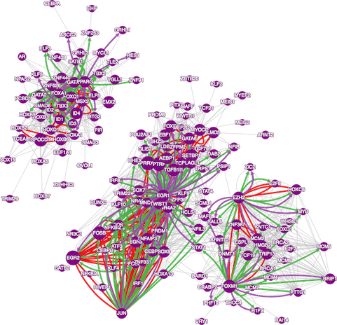

This Vignette accompanies the _CoRegNet_ package. It can be used either
to get some additional information about the methods or to get examples
of the use of the functions. Feel free to ask any question to the
package maintainer (remy.c.nicolle at gmail dot com).


# Introduction

The _CoRegNet_ package aims at inferring a large scale transcription
co-regulatory network from transcriptomic data and at integrating external data
on gene regulation to infer and analyze transcriptional programs. The
particularity of the network inference algorithm proposed in the package
is to learn a co-regulation network in which gene regulation is modeled by
transcription factors acting in a cooperative manner to
synergistically regulate target genes.

The package was used in a study of Bladder Cancer to identify the driver
transcriptional programs from a set of 183 samples. Throughout this
Vignette, a smaller version of this transcriptomic dataset is used to
illustrate the use of the package.

```{r, eval=FALSE}
        library(CoRegNet)
        data(CIT_BLCA_EXP,HumanTF,CIT_BLCA_Subgroup)
        dim(CIT_BLCA_EXP)
        #showing 6 first TF in the gene expression dataset
        head(intersect(rownames(CIT_BLCA_EXP),HumanTF))
```

# Quick user guide

Here are the main functionalities of _CoRegNet_:

1. Reconstruct a large-scale regulatory network from gene expression data
	```{r, eval=FALSE}
		grn = hLICORN(CIT_BLCA_EXP, TFlist=HumanTF)
	```
	
2. Infer transcription factor activity
	```{r, eval=FALSE}
		influence = regulatorInfluence(grn,CIT_BLCA_EXP)
	```
	
3. Retrieve inferred co-regulators
	```{r, eval=FALSE}
		coregs= coregulators(grn)
	```
	
4. Analyze the network of cooperative regulators using an interactive display
	```{r, eval=FALSE}
		display(grn,CIT_BLCA_EXP,influence,clinicalData=CIT_BLCA_Subgroup)
	```


# Construction of a large-scale co-regulatory network from gene expression data


The inference algorithm implemented in the package is a hybrid version
of the *LICORN* algorithm. It is both based on a discrete and continuous
version of the gene expression data. The reconstruction of the network
involves 4 steps. First, the gene expression data is discretized.
Second, all the potential sets of cooperative regulators are extracted
using the *apriori* algorithm of frequent itemset mining. Third, the
best combinations of co-activators and co-inhibitors are identified for
each gene. Finally, a continuous model of regulation using a linear
regression model with interaction terms is used to score the local gene
regulatory networks of each gene.


The minimal input data is:

- a gene expression data.frame or
matrix with unique column names and row names respectively containing sample and gene names
 

- a list of genes to be considered as Transcription factors
(TF). The package contains a default list of Human TF either in the form of
official gene symbol ( _data(HumanTF)_ ) or EntrezGene IDs ( _data(HumanTF\_entrezgene)_ ).


```{r, eval=FALSE}
    # An example of how to infer a co-regulation network
    grn =hLICORN(CIT_BLCA_EXP, TFlist=HumanTF)
    print(grn)
```


The transcriptomic dataset is by default discretized using the
_discretizeExpressionData_ function. This function can be used to discretize
gene expression data with or without a set of reference samples, 
such as healthy samples in the case of the study of a disease.
In both cases, the expression of each gene is centered, either towards the mean expression of all samples when no reference samples are given, or towards the mean of the set of reference samples. Note that the expression is not scaled to obtain a unitary standard deviation.
Generally, even when reference samples are available, centering gene expression on the mean of all experiments performs well, especially on large datasets.
The expression values are then set to +1 when it exceeds a given threshold or to -1 when it goes below a given threshold or to 0 otherwise.
The choice of the threshold is either user-defined or computed based on the overall distribution of the dataset.

Moreover, any discretized data can be used as an input, as long as the discretized matrix has identical dimensions and dimension names to the continuous expression data.
For instance,  a mixture of Gaussians can be fitted to each gene to
identify samples in which a given gene is over-expressed,
under-expressed or does not change.

```{r, eval=FALSE}
    #Default discretization. 
    #Uses the standard deviation of the whole dataset to set a threshold.
    disc1=discretizeExpressionData(CIT_BLCA_EXP)
    table(disc1)
    boxplot(as.matrix(CIT_BLCA_EXP)~disc1)

    #Discretization with a hard threshold
    disc2=discretizeExpressionData(CIT_BLCA_EXP, threshold=1)
    table(disc2)
    boxplot(as.matrix(CIT_BLCA_EXP)~disc2)

    # more examples here
    help(discretizeExpressionData)
```


The overall inference process is highly parallelizable since it can be
independently launched on each target gene and therefore can be divided
in as many threads as there are genes to infer regulators on. By default
the _hLICORN_ function uses the *mclapply* function of the *parallel*
package (default in R >= 3.0), which itself uses 2 cores by default.

```{r, eval=FALSE}
# running only on the 200 first gene in the matrix for fast analysis
    # Choosing to divide in 4 threads whenever possible
    options("mc.cores"=4)
    grn =hLICORN(head(CIT_BLCA_EXP,200), TFlist=HumanTF)
    print(grn)
    options("mc.cores"=2)
    grn =hLICORN(head(CIT_BLCA_EXP,200), TFlist=HumanTF)
    print(grn)
```


Although _hLICORN_ is an inference algorithm that is particularly
efficient in identifying co-regulators, _i.e._ cooperative
transcription factors, the package allows the input of a regulatory network
inferred by other methods or defined by high-throughput biological experiments for the rest of the analysis.


# Refining the inferred regulatory network

The second step of the analysis uses external knowledge to enrich the
inferred regulatory network. Two types of external data can be used:
regulatory data such as Transcription Factor Binding Sites (TFBS)
or ChIP data to support TF to gene interactions and co-regulatory
data such as protein-protein interaction to support cooperative
TFs. These datasets can be easily integrated in a *coregnet* object using
two functions: _addEvidences_ and _addCooperativeEvidences_.


```{r, eval=FALSE}
    # ChIP data from the CHEA database
    data(CHEA_sub)

    #ChIP data from the ENCODE project
    data(ENCODE_sub)

    # Protein protein interactions between TF from the HIPPIE database
    data(HIPPIE_sub)

    # Protein protein interactions between TF from the STRING database
    data(STRING_sub)

    enrichedGRN = addEvidences(grn,CHEA_sub,ENCODE_sub)
    enrichedGRN = addCooperativeEvidences(enrichedGRN,HIPPIE_sub,STRING_sub)
```


The *coregnet* object with added evidences contains a statistical
analysis of the enrichment of the inferred interactions in the validated
external evidences using Fisher's exact test as exemplified below.

```{r, eval=FALSE}
    print(enrichedGRN)
```


The added evidences can be used to refine the inferred network and
select local gene regulatory networks. 
This is based on the work of the _modEncode_ consortium
which proposed a method to integrate orthogonal datasets (transcriptome,
epigenetic marks, binding sites, ...) in order to learn a global network.
Briefly, for each dataset, the method assigns one score to all
inferred interactions. The interactions are then selected based on a final score merging the ones assigned by each dataset. Here,
instead of scoring and selecting single edges, the method is extended
to work with local regulatory networks (sets of co-activators and
co-inhibitors of a given gene). For each dataset, a score is assigned to
each local network by counting the number of validated interactions
found in the local network normalized by the total number
interactions. The score given by the network inference method, an
adjusted R2 in the case of _hLICORN_, and each of the scores given by the
external datasets are then merged. Two methods are proposed by the _modEncode_ consortium to do so.
The default is the unsupervised method, a simple unweighted mean, and
was shown by the modENCODE consortium to give the best results. The
supervised method uses a user defined reference dataset as a reference
set of interactions. A Generalized Linear Model is then used to predict
the presence of a reference interaction based on the score of the other
datasets including the network inference score. 

```{r, eval=FALSE}
        # Default unsupervised refinement method
    refinedGRN = refine(enrichedGRN)
    print(refinedGRN)
    # Example of supervised refinement with the CHEA chip data
    refinedGRN = refine(enrichedGRN, integration="supervised",
            referenceEvidence="CHEA_sub")
    print(refinedGRN)
```

_N.B._: It is possible to use the results of other network inference methods
and integrate them into a *coregnet* network object as
external regulatory evidences.
However, for the integration of co-regulatory evidences, this is only
relevant when using networks containing cooperative regulators instead of simple TF to gene
interaction pairs.


# Identification of active transcriptional programs

The goal of the _CoRegNet_ package is to identify the sets of active
cooperative TFs in a given sample or set of samples. A measure of
transcriptional activity was developed to estimate the level of activity
of a given transcription regulator in a given sample. This measure,
the _influence_, is the comparison the expression of the activated and
repressed genes of a TF in a transcriptional network. It is based on a
measure of divergence (Welch's t statistics) of these two sets of genes
in one sample. Basically, if the genes activated by a TF are highly
expressed while the repressed genes are under-expressed, the TF has a
high influence. The method uses a co-regulatory network encoded in a *coregnet*    
object and a matrix of gene expression, whether it is the same data used for
the inference or another one (cell lines of the same tissue for instance).
The output is a matrix with the same number of columns (samples) and as
many rows (TF) as TF with a sufficient number of targets (default set to a minimum of 10
activated and 10 repressed genes) in the transcriptional network.

```{r, eval=FALSE}
    CITinf =regulatorInfluence(grn,CIT_BLCA_EXP)

```    


This new dataset of transcriptional influence can be used as a condensed
view of the whole transcriptome dataset. Data mining and machine
learning algorithms can be applied to it to identify clusters, predict sample
classes or extract relevant features. More interestingly, it can be
used to visualize the entire dataset with a much smaller number of
features. The
package proposes a visualization tool based on an interactive Shiny
webpage. The objective of the embedded visualization tool is to navigate through 
the transcriptional programs using the network of cooperative
transcription factors and identify the specific transcriptional program
of a sample or a set of samples of interest.

Preliminary to the analysis of transcriptional program is the
identification of the network of co-regulators underlying these
programs. The definition of a pair of cooperative TF or co-regulator is
dependent on the method used to construct the network, that is, whether
it contains simple pairs of regulation (TF -> Gene, inferred using the
ARACNE algorithm for instance) or sets of cooperative TFs regulating each
gene ({TF1, TF2, ...} -> Gene). From
the 'pair' regulatory network (TF->Gene), all combinations of TFs sharing at least one
target gene is considered as a potential pair of co-regulators. From the
cooperative network, these are defined by all pairs of TF which were
inferred to be cooperative in the regulation of at least one target
gene. Then, the significance of these pairs is tested using Fisher's
exact test to assess whether these pairs of TFs share more target genes
than expected by chance (Benjamini-Hochberg multitest correction is
applied). The final co-regulation network is defined by setting an edge between
all pairs of significant TFs (FDR 1%).


```{r, eval=FALSE}
    # Coregulators of a hLICORN  inferred network
    head(coregulators(grn))
```
    

In order to exemplify the use of the proposed tool, additional
datasets are available through the package: the classification of our
samples (based on the TCGA classification) and the copy number status of
the transcription factors in the CIT cohort.
  
 
```{r, eval=FALSE}
    data(CIT_BLCA_CNV)
    data(CIT_BLCA_Subgroup)
```


The minimum requirement to launch the visualization tool is a *coregnet*
network object and a transcriptomic dataset. The influence dataset can
also be added to accelerate the initialization of the webpage but is
otherwise recomputed and is therefore optional.


```{r, eval=FALSE}
    display(grn,expressionData=CIT_BLCA_EXP,TFA=CITinf)
```


The top left part of the shiny application is used to change several
parameters of the application.


The first selection input relates to the sample classification. When a particular subgroup is selected, the nodes representing TFs will adapt their color based on
their mean activity level in the selected set of samples. If alteration
data is available, the pie chart inside each node will by modified to
show the proportion of each copy number status in the selected set of
samples.

The second input specifies an integer used as a threshold to select
pairs of TF which share a minimum number of target genes (local
regulatory network for _hLICORN_ inferred network). This parameter
controls the number of TFs and pairs of TFs displayed.

The third input can be used to search a TF in the network.

The layout button can be used to change the layout of the network. This
can be a long process for large networks.


The bottom panel is used to display specific plots. A heatmap of TF
influence is displayed by default. If only a subset of TF is selected
in the cytoscape panel, the heatmap will only display the influence of
the selected TF. Selecting a single TF will display data specific to
that TF which is dependent on the data used as input. Each of the data
is represented as an array of color ordered by the activity of the
selected TF. The plotted data includes the expression of the TF, the
activity of the TF and the expression of the activated and the repressed
samples.

The visualization tool can also handle alteration data, sample
classification and evidences of regulation or co-regulation. Several
examples are shown below.

 
```{r, eval=FALSE}
    # Visualizing additional regulatory or co-regulatory evidences in the network
    display(enrichedGRN,expressionData=CIT_BLCA_EXP,TFA=CITinf)


    # Visualizing sample classification using a named factor
    display(grn,expressionData=CIT_BLCA_EXP,TFA=CITinf,clinicalData=CIT_BLCA_Subgroup)

    # Visualizing copy number alteration of regulators
    data(CIT_BLCA_CNV)
    display(grn,expressionData=CIT_BLCA_EXP,TFA=CITinf,clinicalData=CIT_BLCA_Subgroup,alterationData=CIT_BLCA_CNV)
   
```


_N.B._: the Cytoscape network snapshot is experimental and usually is
one snapshot late. Going back and forth to the snapshot tab once
or twice should do the trick to have the latest snapshot. Hopefully this
will be corrected by the Cytoscape.JS team.

***


# Snapshots and examples


The following contains snapshots of the shiny interactive user interface for the visualization of a co-regulatory network driving bladder cancer.


The Co-regulation page is divided in three parts (see figure 1).
In the top left corner, a control panel lists the samples and samples subtype to analyze, the number of minimum GRN to select significant cooperative interactions and an input to search for a particular TF in the network.
In the right part, an interactive Cytoscape javascript widget displays the network of co-regulators. The color of the nodes reflects the activity of the TF in the selected subtype as shown in figures 2 and 3 for two types of bladder cancers.
The bottom part of the page contains a plot reactive to action performs on the network.


<center> *Figure 1: View of the shiny Web page* </center>

## Subtype specific co-regulator network. The color of each TF/node is based on the mean influence in all samples of the subtype


<center> *Figure 2: Basal-like bladder cancer co-regulator network* </center>


<center> *Figure 3: Luminal-like bladder cancer co-regulator network* </center>


***

When no nodes are selected in the Cytoscape widget, a heatmap of the TF influence is displayed (as in figure 1). When several nodes are selected, the heatmap will contain only the influence of the selected TF.
The selection of a single TF will display a multi-layer heatmap for each type of information given as an input to the application.
An example is shown in figure 4.
The first heatmap color-codes the sample classification. The second shows the Copy Number status of the select TF. The third and fourth show the influence and expression values of the selected TF. Finally, the fifth and sixth heatmap display the expression of the activated and repressed genes respectively.


<center> *Figure 4: Local TF related heatmap.*
Expression is color coded from green to red (low to high) and the influence from blue to red (low to high). Heatmaps display one sample per column.</center>

*** 

Finally, when additional regulatory evidences were integrated in the network, the Cytoscape network will display these interactions in addition to the inferred co-regulation interactions as shown in figure 5. Regulatory evidences will be displayed as directed edges between TF while cooperative evidences will be shown as undirected edges.




<center> *Figure 5: Multiple types of interactions.*
 Grey: predicted cooperative interactions. Green: regulatory interactions from the ENCODE ChIP-seq data. Purple: regulatory interactions from the CHEA2 ChIP data. Red: protein interaction from the STRING database. 
</center>


